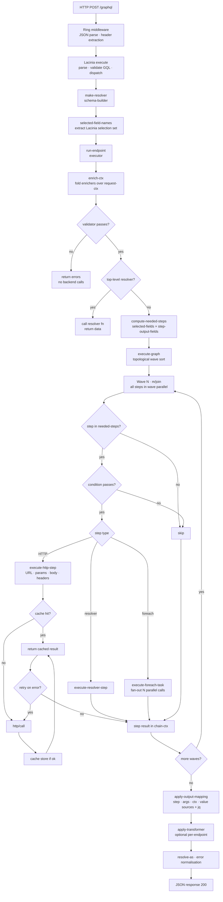

# BFF Request Lifecycle



---

## Startup — `bff.core/create-handler`

| Step | File | What happens |
|---|---|---|
| env log level | `core.clj` | Reads `BFF_LOG_LEVEL`, calls `log/set-min-level!` if set. |
| load + compile spec | `spec-loader.clj` | YAML parsed, env-var substitutions applied. JQ expressions compiled to `:compiled-jq` handles. Transformer namespaces required. `step-output-fields` reverse index built per endpoint — maps each step id to the set of top-level output field keywords that reference it. |
| build Lacinia schema | `schema-builder.clj` | Object types, input types, and scalars assembled. Each endpoint gets a resolver closure capturing the compiled endpoint and the extensions map. Schema compiled via `lacinia/schema/compile`. |
| SDL emission | `sdl.clj` | Schema text generated once, served at `/schema.graphqls`. |
| Ring middleware | `core.clj` | `wrap-json-body`, `wrap-json-response`, `wrap-params` stacked around the handler. |

The extensions map is captured in every resolver closure and never mutated at request time.

---

## Incoming request — Ring handler

GET `/graphiql` and `/schema.graphqls` are handled before the GraphQL path. OPTIONS returns CORS pre-flight headers.

For a POST, the handler pulls `query`, `variables`, and `operationName` from the parsed JSON body and builds `request-ctx` — a flat map of selected headers plus `:remote-addr`:

```
; default forwarded headers
["authorization" "x-request-id" "x-correlation-id"]

; spec can override with forward_headers: [...]
```

`request-ctx` is merged into step headers and is available to input mappings, validators, and output mappings.

---

## GraphQL resolver — `schema-builder/make-resolver`

Lacinia dispatches to the resolver closure for the matched query or mutation.

**Selection extraction.** `selected-field-names` reads `:com.walmartlabs.lacinia/selection` from the Lacinia context and collects the top-level field alias names as a keyword set, which `run-endpoint` uses to compute which steps to skip.

**Executor call.**

```clojure
(executor/run-endpoint endpoint args request-ctx extensions selected-fields)
```

The task runs to completion synchronously via `CompletableFuture`. Errors are surfaced through `resolve/resolve-as`.

---

## Endpoint pipeline — `executor/run-endpoint`

Steps run in order; each can short-circuit.

### 1. Enrichment

`enricher/enrich-ctx` folds the configured enrichers over `request-ctx` in order. Each enricher receives the accumulated ctx and returns a map to merge in. Typical pattern: decode the inbound JWT, attach claims like `:customer-id` and `:roles` so downstream steps don't each repeat the lookup.

### 2. Validation

`validator/run-validation` runs built-in arg rules (`pattern`, `min`, `max`) then the optional custom validator from `validator: {key: "..."}`. On failure the pipeline stops with no backend calls.

### 3. Top-level resolver shortcut

If the endpoint has a top-level `resolver` key, it is called directly with `(args, request-ctx)` and the result is returned, skipping the backend chain.

### 4. Step selection

`compute-needed-steps` intersects `selected-fields` with the `step-output-fields` index, then expands the result transitively to include deps of needed steps. Steps absent from the index (no output field references them) always run. When `selected-fields` is empty, `needed-steps` is `nil` and all steps run.

### 5. execute-graph

`graph/execution-waves` topologically sorts the chain into sequential waves; steps within a wave have no intra-wave dependencies and run in parallel via `m/join`.

```
Wave 0: [user-step  address-step]   ; parallel
Wave 1: [summary-step]              ; depends on both
```

Fails fast if any step throws. Compensation records accumulate across waves; a critical step failure triggers reverse-order compensation before re-throwing.

After all waves, `chain-ctx` is a flat map from step id (keyword) to `{:status :ok/:error :data {...}}`.

---

## Step dispatch

### Skip conditions

A step returns nil (dropped from wave results) when either holds:

- `needed-steps` is non-nil and the step id is absent from it.
- The step's `condition` expression evaluates to false.

### HTTP step — `execute-http-step`

1. URL template interpolated from args and chain-ctx.
2. `input_mapping` resolved to query params.
3. `body_mapping` resolved to request body.
4. Headers: `request-ctx` merged with `extra_headers`, all keys stringified, nil values dropped.
5. Cache lookup — hit returns immediately.
6. `http/call`.
7. Successful response stored in cache on a miss.
8. Retry loop if `retry` is configured.

### Resolver step

Calls a registered resolver function with `(input-mapping-result, request-ctx)`. The return value becomes the step's data.

### Foreach step

Resolves the list from `foreach`, fans out one step copy per item in parallel via `m/join`, with the item injected under `item_as`. Fails fast on the first error. Returns `{:data [item-results...]}`.

### Value resolution — sources

| source | step_id | Resolves from |
|---|---|---|
| `step` | required | `chain-ctx[step_id].data` + optional jq |
| `args` | optional | GraphQL operation arguments |
| `ctx` | optional | `request-ctx` |
| `value` | — | Literal from spec + optional jq |

All sources pass through `maybe-jq` when a `jq` expression is present on the mapping.

---

## Output — mapping and transformer

### apply-output-mapping

Walks `output_mapping` and resolves each top-level field using the same source/jq machinery. Nested fields recurse. The result is a plain map matching the GraphQL output type.

### Error collection

`error/step-errors` collects steps with status `:error` before output mapping runs. Output mapping continues against data from successful steps — partial data comes back alongside errors.

### apply-transformer

If `transformer: {key: "..."}` is set on the endpoint, the registered function is called with `(args, chain-ctx, mapped-output)` and its return replaces the mapped output. The transformer does not receive `request-ctx`.

### Error normalisation

`error->graphql` in `schema-builder` normalises errors before handing them to Lacinia. Step errors already carry `:extensions {:code ...}`. Resolver errors may set `:code` at the top level — it is lifted into `:extensions.code`.

---

## Extension points

| Extension | Configured as | When it runs |
|---|---|---|
| enricher | `:enrichers [impl...]` | Once per request, before validation. |
| validator | `:validators {"key" impl}` + `validator: {key: ...}` in spec | After enrichment. Short-circuits on failure. |
| resolver | `:resolvers {"key" impl}` + `resolver: {key: ...}` in spec | In place of HTTP for that step, or for the whole endpoint. |
| transformer | `:transformers {"key" impl}` + `transformer: {key: ...}` in spec | After output mapping. |
| retry-hook | `:retry-hooks {"key" impl}` + `retry: {hook: ...}` in spec | Before each retry attempt. |
| cache | `:cache CacheStore-impl` | Checked and stored around HTTP calls with `cache:` configured. |
| http-client | `:http-client impl` | Replaces the default Hato client for all HTTP steps. |
